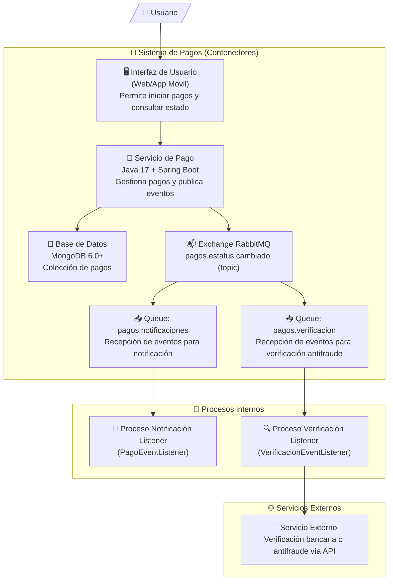

# Pagos Service API

Descripción del ejercicio.

```
EJERCICIO
Objetivo
Realizar un proyecto que tenga los siguientes servicios:
• Dar de alta un pago con al menos los siguientes atributos:
– concepto
– cantidad de productos
– quién realiza el pago
– a quién se le paga
– monto total
– estatus del pago
• Tener la capacidad de verificar el estatus del pago
• Tener la capacidad de cambiar el estatus del pago
• Una vez que el estatus cambie, notificarlo a RabbitMQ, pensar que con este evento podría
haber 2 o más tareas (consumers).
Herramientas:
• Java 17
• Spring boot 3.2.0+
• MongoDB 6.0+
• RabbitMQ 3.12+
• jUnit
• Docker
Entregables:
• código Java
• Esquema de Base de datos (json schema)
• Archivos docker como .Dockerfile y docker-compose
• Collection de postman
• Doc de definición de exchanges/queues/mensaje
Proporcionar el producto del ejercicio por medio de un repositorio git (github,
bitbucket, etc)
```

---

## 📋 Índice de Documentación

- [Plan de Desarrollo](docs/plan-desarrollo.md)
- [Checklist de Entregables](docs/checklist-entregables.md)
- [Definición de Exchanges, Queues y Mensajes](docs/queues-and-messages.md)
- [Esquema de Base de Datos (JSON Schema)](docs/db-scheme.json)
- [Collection de Postman para pruebas](docs/pagos-service-collection.json)
- [Configuración de ambiente de desarrollo](docs/setup-dev-md)

---

### Valor agregado 

- Spring actuator (monitoreo de eventos) 
- swagger como documentación. 

#### No funcionales obligatorios 

- Redacción clara y concisa del README 

## Análisis 

A continuación, se presentan algunos aspectos a considerar durante el desarrollo del proyecto: 

     Seguridad: Es importante asegurarse de que la aplicación sea segura y no sufra ataques de seguridad.
     Escalabilidad: La aplicación debe ser capaz de escalar para soportar un gran número de usuarios y solicitudes.
     Rendimiento: La aplicación debe tener un buen rendimiento para proporcionar una experiencia de usuario adecuada.

## Diseño de la Arquitectura 

A continuación, se presentan los componentes principales de la arquitectura del proyecto:

- **Servicio de Pago (SP):** Gestiona el registro y cambio de estatus de pagos, publica eventos a RabbitMQ.
- **Base de Datos (BD):** MongoDB para almacenar los datos de pagos de forma persistente.
- **RabbitMQ (RMQ):** Broker de mensajería para propagar cambios de estatus de forma desacoplada.
- **Proceso de Notificación (PN):** Consumer que recibe eventos de RabbitMQ y procesa notificaciones internas.
- **Proceso de Verificación (PV):** Segundo Consumer que procesa eventos para iniciar verificación antifraude.
     

### Capas de la Aplicación 

La aplicación tiene las siguientes capas: 

     Capa de Presentación: Esta capa se encarga de presentar la interfaz de usuario al cliente.
     Capa de Negocio: Esta capa se encarga de procesar las solicitudes y respuestas entre el servicio de pago y la base de datos.
     Capa de Datos: Esta capa se encarga de almacenar y recuperar los datos de la base de datos.
     

### Componentes 

- **Servicio de Pago (SP):** Exposición de APIs REST para registrar y cambiar estatus de pagos.
- **Base de Datos (BD):** Persistencia de pagos usando MongoDB.
- **RabbitMQ (RMQ):** Orquestación de eventos de cambio de estatus mediante exchange tipo topic.
- **Proceso de Notificación (PN):** Consumer que procesa eventos de cambios para notificaciones.
- **Proceso de Verificación (PV):** Consumer que procesa eventos para iniciar validaciones antifraude o validaciones adicionales.

### Diagramas

A continuación, se presenta un diagrama de contenedores con correspondencia al modelo C4: 


     


> **Nota:** El evento de cambio de estatus publicado por el Servicio de Pago es enviado a dos colas distintas. Esto permite que múltiples procesos internos (notificación y verificación) reaccionen de forma desacoplada, siguiendo un patrón de Event-Driven Architecture (EDA).

## Documentación Swagger

Acceso en:

http://localhost:8080/swagger-ui.html

## Endpoints Actuator

Healthcheck disponible en:

http://localhost:8080/actuator/health

