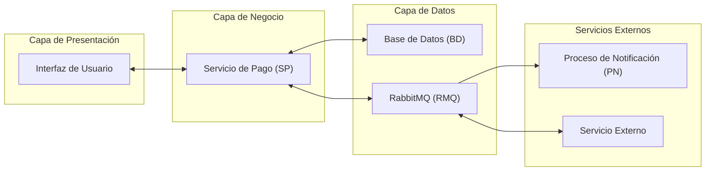
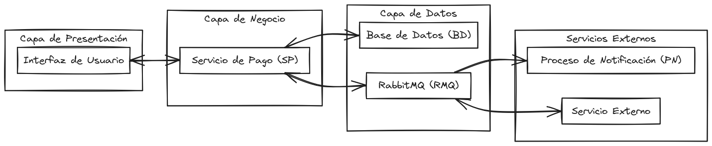

# prueba-tecnica
Prueba técnica desarrollo de demo de un sistema de pagos.

## Requisitos 

A continuación, se presentan los requisitos del ejercicio: 

- Requisito 1: Crear un servicio de pago que permita registrar un pago y cambiar el estatus del pago. 

     El servicio debe poder registrar un pago con los siguientes datos:
     

     Id de la transacción
     Fecha de registro
     Monto del pago
     Estadío actual (pendiente, aprobado o rechazado)
     

     El servicio debe poder cambiar el estatus del pago.
     El servicio debe notificar a RabbitMQ cuando se cambie el estatus del pago.
     

- Requisito 2: Crear un proceso que reciba los mensajes de cambio de estatus del pago desde RabbitMQ y actualice el estatus correspondiente en la base de datos. 

     El proceso debe poder recibir los mensajes de cambio de estatus del pago desde RabbitMQ.
     El proceso debe actualizar el estatus correspondiente en la base de datos.
     El proceso debe asegurarse de que el estatus sea válido antes de actualizarlo.
     

- Requisito 3: Crear una base de datos para almacenar los datos de los pagos. 

     La base de datos debe tener una estructura adecuada para almacenar los datos de los pagos.
     La base de datos debe ser capaz de soportar un gran número de registros y consultas.
     

- Requisito 4: Crear un proceso que se encargue de la comunicación con RabbitMQ. 

     El proceso debe poder conectarse a RabbitMQ y publicar mensajes cuando se cambie el estatus del pago.
     El proceso debe poder recibir mensajes desde RabbitMQ y procesarlos adecuadamente.
     

- Requisito 5: Desplegar la aplicación en un entorno de producción. 

     La aplicación debe ser capaz de desplegarse en un entorno de producción sin problemas.
     La aplicación debe estar preparada para soportar un gran número de usuarios y solicitudes.
     

## Análisis 

A continuación, se presentan algunos aspectos a considerar durante el desarrollo del proyecto: 

     Seguridad: Es importante asegurarse de que la aplicación sea segura y no sufra ataques de seguridad.
     Escalabilidad: La aplicación debe ser capaz de escalar para soportar un gran número de usuarios y solicitudes.
     Rendimiento: La aplicación debe tener un buen rendimiento para proporcionar una experiencia de usuario adecuada.

## Diseño de la Arquitectura 

A continuación, se presentan los componentes principales de la arquitectura del proyecto: 

     Servicio de Pago: Es el servicio principal que permite registrar un pago y cambiar el estatus del pago.
     Base de Datos: Es la base de datos que almacena los datos de los pagos.
     RabbitMQ: Es el mensaje broker que se utiliza para notificar a los procesos cuando se cambie el estatus del pago.
     Proceso de Notificación: Es el proceso que recibe los mensajes de cambio de estatus del pago desde RabbitMQ y actualiza el estatus correspondiente en la base de datos.
     

### Capas de la Aplicación 

La aplicación tiene las siguientes capas: 

     Capa de Presentación: Esta capa se encarga de presentar la interfaz de usuario al cliente.
     Capa de Negocio: Esta capa se encarga de procesar las solicitudes y respuestas entre el servicio de pago y la base de datos.
     Capa de Datos: Esta capa se encarga de almacenar y recuperar los datos de la base de datos.
     

### Componentes 

A continuación, se presentan algunos componentes importantes en la arquitectura del proyecto: 

     Servicio de Pago (SP): Es el componente que permite registrar un pago y cambiar el estatus del pago.
     Base de Datos (BD): Es el componente que almacena los datos de los pagos.
     RabbitMQ (RMQ): Es el componente que se utiliza para notificar a los procesos cuando se cambie el estatus del pago.
     Proceso de Notificación (PN): Es el componente que recibe los mensajes de cambio de estatus del pago desde RabbitMQ y actualiza el estatus correspondiente en la base de datos.
     

### Diagrama de Clases 

A continuación, se presenta un diagrama de clases que muestra las relaciones entre los componentes: 

     

