# prueba-tecnica
     

Prueba técnica desarrollo de demo de un sistema de pagos.
     

## Paso 1: Plan de Desarrollo

Antes de empezar a escribir código, es importante definir un plan de desarrollo para saber qué hacer y en qué orden. A continuación, se presentan los pasos generales que debemos seguir:

1. **Análisis de requisitos**  
   Revisaremos cuidadosamente los requisitos del ejercicio y nos aseguraremos de entender cada uno de ellos.  
   ✅ _Checklist funcional disponible más abajo._

2. **Diseño de la arquitectura**  
   Definiremos la arquitectura del proyecto, incluyendo las capas de la aplicación, la base de datos y la comunicación con RabbitMQ.

3. **Creación de la base de datos**  
   Creamos la estructura de la base de datos en MongoDB según el esquema que se definirá posteriormente.

4. **Implementación del servicio de pago**  
   Desarrollaremos el servicio que permita registrar un pago y cambiar el estatus.

5. **Implementación de la comunicación con RabbitMQ**  
   Implementaremos la conexión con RabbitMQ para notificar los cambios en el estatus del pago.

6. **Pruebas unitarias y de integración**  
   Realizaremos pruebas automatizadas para asegurar calidad y cobertura.

7. **Despliegue y revisión final**  
   Desplegaremos la aplicación en un entorno de producción y realizaremos una validación final.

### ✔️ Checklist de requisitos funcionales

- [ ] Registro de pago con: concepto, cantidad de productos, quién paga, a quién se paga, monto total, estatus
- [ ] Verificación del estatus del pago vía API
- [ ] Cambio del estatus de un pago
- [ ] Publicación de evento de cambio de estatus a RabbitMQ
- [ ] Posibilidad de múltiples consumidores del evento

## Paso 2: Preparación del Entorno

Para poder desarrollar el proyecto, debemos preparar el entorno. Esto incluye:

- **Instalación de herramientas**  
  Java 17, Docker, MongoDB y RabbitMQ (se usarán contenedores para facilitar el setup).

- **Configuración del entorno con Docker**  
  Se incluirá un `docker-compose.yml` para levantar:
  - MongoDB
  - RabbitMQ (con consola habilitada)
  - La aplicación Spring Boot

- **Perfiles de entorno (`spring.profiles.active`)**  
  Se definirá al menos un perfil `dev` y `prod` para separar la configuración.

- **Documentación de instalación local**  
  Se incluirá `docs/setup-dev.md` con instrucciones paso a paso para levantar el entorno de desarrollo.

## Paso 3: Desarrollo

Una vez preparado el entorno, se procede al desarrollo del sistema. Esta etapa se dividirá en los siguientes componentes:

- **Implementación del Servicio de Pago**
  - Exposición de endpoints REST para registrar y actualizar el estatus de un pago.
  - Validación de entrada y lógica de negocio en un servicio separado.
  - Acceso a MongoDB mediante `Spring Data MongoDB`.

- **Modelo de Datos**
  - El documento de pago incluirá: concepto, cantidad de productos, quién paga, a quién se le paga, monto total, estatus y fecha de registro.

- **Publicación de eventos a RabbitMQ**
  - Se usará un publisher asíncrono que enviará un evento cada vez que se actualice el estatus del pago.
  - El evento incluirá `id_transacción`, `estatus`, y `timestamp`.

- **Configuración de perfiles**
  - Se mantendrán configuraciones distintas para `dev` y `prod` usando `application-{profile}.yml`.

- **Documentación Swagger**
  - Se integrará `springdoc-openapi` para exponer la documentación interactiva de la API.

## Paso 4: Pruebas

Una vez que el desarrollo esté completo, se deben realizar pruebas exhaustivas para garantizar el correcto funcionamiento del sistema:

- **Pruebas Unitarias**
  - Pruebas a nivel de servicio y utilidades usando JUnit 5.
  - Uso de `Mockito` para mocks de dependencias como la base de datos o RabbitMQ.

- **Pruebas de Integración**
  - Pruebas que validen el flujo completo desde los endpoints hasta la base de datos.
  - Uso opcional de `TestContainers` para levantar MongoDB y RabbitMQ reales durante las pruebas.

- **Cobertura**
  - Se incluirá configuración para `jacoco` que permita verificar la cobertura de código.

- **Ejecución**
  - Todas las pruebas se ejecutarán con un solo comando (`mvn test` o vía GitHub Actions si se configura pipeline).

## Paso 5: Revisión Final

Esta fase garantiza que todo está correcto antes de entregar el proyecto:

- **Revisión de código**
  - Validación de estilo, estructura, buenas prácticas y principios SOLID.
  - Revisión cruzada si aplica.

- **Pruebas adicionales**
  - Validación de escenarios no cubiertos, errores esperados, entradas inválidas, etc.

- **Verificación de entregables**
  - Código funcional y probado.
  - Dockerfile y docker-compose para producción.
  - JSON Schema de base de datos.
  - Collection Postman.
  - Documentación Swagger activa.
  - README actualizado y conciso.
  - Documentación de colas/exchanges (en `/docs` o inline).

- **Entrega**
  - Se subirá a un repositorio git (GitHub o Bitbucket) público o privado.
  - Se incluirán instrucciones de ejecución (`make`, `run.sh` o `README`).

## Análisis de requisitos 

A continuación, se presentan los requisitos del ejercicio: 

- Requisito 1: Crear un servicio de pago que permita registrar un pago y cambiar el estatus del pago. 

     El servicio debe poder registrar un pago con los siguientes datos:
     

    1. Id de la transacción
    2. Fecha de registros
    3. Concepto
    4. Cantidad de productos
    5. Quién realiza el pago
    6. A quién se realiza el pago
    7. Monto total
    8. Estatus actual (pendiente, aprobado, rechazado)

     El servicio debe poder cambiar el estatus del pago.
     El servicio debe notificar a RabbitMQ cuando se cambie el estatus del pago.
     

- Requisito 2: Crear un proceso que reciba los mensajes de cambio de estatus del pago desde RabbitMQ y actualice el estatus correspondiente en la base de datos. 

     El proceso debe poder recibir los mensajes de cambio de estatus del pago desde RabbitMQ.
     El proceso debe actualizar el estatus correspondiente en la base de datos.
     El proceso debe asegurarse de que el estatus sea válido antes de actualizarlo.
     

- Requisito 3: Crear una base de datos para almacenar los datos de los pagos. 

     La base de datos debe tener una estructura adecuada para almacenar los datos de los pagos.
     La base de datos debe ser capaz de soportar un gran número de registros y consultas.
     

- Requisito 4: Crear un proceso que se encargue de la comunicación con RabbitMQ. 

     El proceso debe poder conectarse a RabbitMQ y publicar mensajes cuando se cambie el estatus del pago.
     El proceso debe poder recibir mensajes desde RabbitMQ y procesarlos adecuadamente.
     

- Requisito 5: Desplegar la aplicación en un entorno de producción. 

     La aplicación debe ser capaz de desplegarse en un entorno de producción sin problemas.
     La aplicación debe estar preparada para soportar un gran número de usuarios y solicitudes.

- Técnicos:
    
    - Java 17
    - Spring boot 3.2.0+
    - MongoDB 6.0+
    - RabbitMQ 3.12+
    - jUnit
    - Docker

## Entregables

### Obligatorios

- código Java
- Esquema de Base de datos (json schema)
- Archivos docker como .Dockerfile y docker-compose
- Collection de postman
- Doc de definición de exchanges/queues/mensaje

Proporcionar el producto del ejercicio por medio de un repositorio git (github,
bitbucket, etc)

### Valor agregado 

- Spring actuator (monitoreo de eventos) 
- Pipeline de despliegue (jenkins o github actions ¿mejor opción?) 
- spring security (cifrado de campos, y jwt) 
- playbook ansible y spring profiles. 
- Respaldos de la base de datos y configurar un sharding. 
- swagger como documentación. 

#### No funcionales obligatorios 

- Redacción clara y concisa del README 

## Análisis 

A continuación, se presentan algunos aspectos a considerar durante el desarrollo del proyecto: 

     Seguridad: Es importante asegurarse de que la aplicación sea segura y no sufra ataques de seguridad.
     Escalabilidad: La aplicación debe ser capaz de escalar para soportar un gran número de usuarios y solicitudes.
     Rendimiento: La aplicación debe tener un buen rendimiento para proporcionar una experiencia de usuario adecuada.

## Diseño de la Arquitectura 

A continuación, se presentan los componentes principales de la arquitectura del proyecto: 

     Servicio de Pago: Es el servicio principal que permite registrar un pago y cambiar el estatus del pago.
     Base de Datos: Es la base de datos que almacena los datos de los pagos.
     RabbitMQ: Es el mensaje broker que se utiliza para notificar a los procesos cuando se cambie el estatus del pago.
     Proceso de Notificación: Es el proceso que recibe los mensajes de cambio de estatus del pago desde RabbitMQ y actualiza el estatus correspondiente en la base de datos.
     

### Capas de la Aplicación 

La aplicación tiene las siguientes capas: 

     Capa de Presentación: Esta capa se encarga de presentar la interfaz de usuario al cliente.
     Capa de Negocio: Esta capa se encarga de procesar las solicitudes y respuestas entre el servicio de pago y la base de datos.
     Capa de Datos: Esta capa se encarga de almacenar y recuperar los datos de la base de datos.
     

### Componentes 

A continuación, se presentan algunos componentes importantes en la arquitectura del proyecto: 

     Servicio de Pago (SP): Es el componente que permite registrar un pago y cambiar el estatus del pago.
     Base de Datos (BD): Es el componente que almacena los datos de los pagos.
     RabbitMQ (RMQ): Es el componente que se utiliza para notificar a los procesos cuando se cambie el estatus del pago.
     Proceso de Notificación (PN): Es el componente que recibe los mensajes de cambio de estatus del pago desde RabbitMQ y actualiza el estatus correspondiente en la base de datos.
     

### Diagramas

A continuación, se presenta un diagrama de contenedores con correspondencia al modelo C4: 

```mermaid
graph TD

    %% Persona
    Usuario[/"👤 Usuario"/]

    %% Sistema principal
    subgraph "🧩 Sistema de Pagos (Contenedores)"
        UI["🖥️ Interfaz de Usuario\n(Web/App Móvil)\nPermite iniciar pagos y consultar estado"]
        SP["🔧 Servicio de Pago\nJava 17 + Spring Boot\nExpone API REST, procesa lógica de negocio,\npublica eventos a RabbitMQ"]
        BD["💾 Base de Datos\nMongoDB 6.0+\nColección de pagos con índices por estatus y fecha"]
        RMQ["📬 RabbitMQ\nBroker de mensajería\nPublica y enruta eventos asincrónicos"]
        PN["📣 Proceso de Notificación\nWorker interno\nConsume eventos y actualiza estado en MongoDB"]
    end

    %% Sistema externo
    subgraph "🌐 Servicios Externos"
        SE["🏦 Servicio Externo\nVerificación bancaria o antifraude vía API"]
    end

    %% Relaciones
    Usuario --> UI
    UI --> SP
    SP --> BD
    SP --> RMQ
    RMQ --> PN
    PN --> BD
    RMQ <--> SE

```

     

